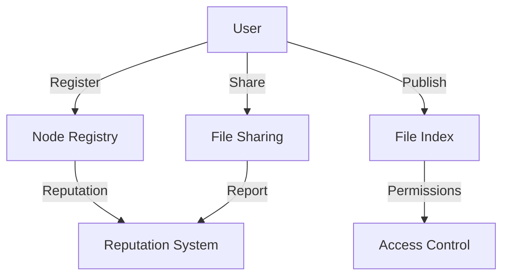

# NodeLink Decentralized Sharing

A decentralized peer-to-peer file sharing network built on the Stacks blockchain that enables secure file sharing with ownership control and access permissions.

## Overview

NodeLink creates a censorship-resistant file sharing ecosystem by combining blockchain security with off-chain efficiency. The system uses smart contracts to coordinate:

- Node registration and reputation tracking
- File metadata and indexing
- Access permissions and control
- Node discovery and coordination

While keeping actual file transfers peer-to-peer and off-chain.

## Architecture

The system is built around a core smart contract that manages the network's coordination layer. Here's how the components work together:



### Core Components:
- **Node Registry**: Tracks active network participants
- **File Index**: Stores file metadata and availability
- **Access Control**: Manages file permissions
- **Reputation System**: Tracks node reliability
- **Sharing Coordination**: Manages active file sharing status

## Contract Documentation

### NodeLink Core Contract

The main contract managing the NodeLink network's coordination layer.

#### Key Features:
- Node registration and activity management
- File metadata publishing and indexing
- Access control for private files
- Reputation tracking system
- File sharing status coordination

#### Access Control:
- Only registered nodes can publish files
- File updates restricted to original owners
- Access permissions managed by file owners
- Reputation changes limited to peer reports

## Getting Started

### Prerequisites
- Clarinet
- Stacks wallet
- NodeLink client software (for actual file transfers)

### Basic Usage

1. Register as a node:
```clarity
(contract-call? .nodelink-core register-node)
```

2. Publish a file:
```clarity
(contract-call? .nodelink-core publish-file 
    "file-id" 
    "filename" 
    "description" 
    u1000 
    "text/plain" 
    0x... 
    true)
```

3. Share an existing file:
```clarity
(contract-call? .nodelink-core share-file "file-id")
```

## Function Reference

### Node Management
- `register-node`: Register as a network node
- `deactivate-node`: Temporarily deactivate your node
- `reactivate-node`: Reactivate a deactivated node

### File Management
- `publish-file`: Add a new file to the network
- `update-file-metadata`: Update existing file information
- `share-file`: Start sharing a file
- `stop-sharing-file`: Stop sharing a file

### Access Control
- `grant-file-access`: Give a user access to a private file
- `revoke-file-access`: Remove a user's access to a private file

### Reputation System
- `report-successful-transfer`: Report successful file transfer
- `report-violation`: Report node misbehavior

## Development

### Testing
1. Install Clarinet
2. Clone the repository
3. Run tests:
```bash
clarinet test
```

### Local Development
1. Start Clarinet console:
```bash
clarinet console
```

2. Deploy contract:
```bash
clarinet deploy
```

## Security Considerations

### Limitations
- File content is not stored on-chain
- Reputation system relies on peer reporting
- Network dependent on active node participation

### Best Practices
- Verify file hashes before and after transfer
- Maintain good node reputation to ensure sharing privileges
- Regular monitoring of node status and sharing activities
- Implement appropriate off-chain security measures for file transfers

### Reputation Requirements
- Minimum reputation (10) required to share files
- Maximum reputation change of 5 points per report
- Reputation bounded between 0 and 100
- Cannot self-report or manipulate own reputation